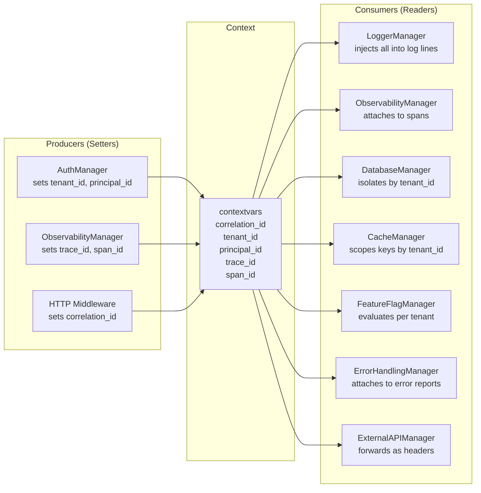

# Context Propagation

core-cenf propagates correlation and tracing identifiers across async boundaries using
Python's `contextvars` module. The identifiers are **implicit** — you never pass them as
function arguments. Every manager reads them automatically.

## Why contextvars?

In an async Python application, a single thread handles many concurrent tasks. Passing
request-scoped values (like a correlation ID or tenant ID) through every function
signature pollutes every interface:

```python
# ❌ Explicit propagation — every function must accept and forward context
async def handle_request(correlation_id: str, tenant_id: str, request: Request):
    result = await process(correlation_id, tenant_id, request.body)
    await store(correlation_id, tenant_id, result)
```

`contextvars` solve this by storing values in a per-task context that follows the call
chain automatically:

```python
# ✅ Implicit propagation — context is set once and flows everywhere
context.set_correlation_id("req-abc123")
context.set_tenant_id("tenant-xyz")
# ... any async call downstream reads these without explicit arguments ...
```

## The Five Context Variables

All five are module-level `ContextVar` instances with safe defaults:

| Variable | Default | Purpose | Set by | Read by |
|---|---|---|---|---|
| `correlation_id` | `"system-init"` | Links all logs and spans for one request | AuthManager, HTTP middleware | LoggerManager, ObservabilityManager, all managers |
| `tenant_id` | `"global"` | Multi-tenant data isolation identifier | AuthManager (from JWT claims) | DatabaseManager, CacheManager, FeatureFlagManager |
| `principal_id` | `""` | Principal (user/service) for audit trails | AuthManager (from JWT claims) | LoggerManager, ErrorHandlingManager |
| `trace_id` | `""` | OpenTelemetry trace identifier (hex) | ObservabilityManager | LoggerManager, ExternalAPIManager |
| `span_id` | `""` | OpenTelemetry span identifier (hex) | ObservabilityManager | LoggerManager |

These variables are declared in `core_infrastructure.common.context`:

```python
from contextvars import ContextVar

_correlation_id: ContextVar[str] = ContextVar("cenf_correlation_id", default="system-init")
_tenant_id: ContextVar[str] = ContextVar("cenf_tenant_id", default="global")
_principal_id: ContextVar[str] = ContextVar("cenf_principal_id", default="")
_trace_id: ContextVar[str] = ContextVar("cenf_trace_id", default="")
_span_id: ContextVar[str] = ContextVar("cenf_span_id", default="")
```

## Producer / Consumer Matrix

The producers SET contextvars at boundaries. The consumers READ them internally to attach
metadata to logs, spans, and outbound requests.



## Reading Context

Any code can read the current values with zero ceremony:

```python
from core_infrastructure.common.context import (
    get_correlation_id,
    get_tenant_id,
    get_principal_id,
    get_trace_id,
    get_span_id,
)

cid = get_correlation_id()   # "req-abc123" or "system-init"
tid = get_tenant_id()        # "tenant-xyz" or "global"
pid = get_principal_id()     # "user-123" or ""
trace = get_trace_id()       # "a1b2c3d4..." or ""
span = get_span_id()         # "e5f6g7h8..." or ""
```

These are synchronous, zero-overhead calls. No async, no I/O, no exceptions.

## Setting Context

Setters are only called at boundary points — HTTP middleware, message queue handlers,
JWTAuthAdapter validation:

```python
from core_infrastructure.common.context import (
    set_correlation_id,
    set_tenant_id,
    set_principal_id,
)

# Called by HTTP middleware or AuthManager.validate_token()
set_correlation_id("req-abc123")
set_tenant_id("tenant-xyz")
set_principal_id("user-456")
```

**Rule**: setters should never be called from domain code. Context is set at the boundary
and flows inward.

## Generating Correlation IDs

When no incoming correlation ID exists, generate a fresh one:

```python
from core_infrastructure.common.context import new_correlation_id

cid = new_correlation_id()  # "d4e5f6a7-b8c9-4def-a123-4567890abcde"
# The contextvar is set AND the UUID4 string is returned
```

## Snapshot and Restore

When crossing boundaries where contextvars might be lost (SAQ job payloads, outbound HTTP
requests to external systems), capture and restore the context:

```python
from core_infrastructure.common.context import get_context_snapshot, restore_context_snapshot

# Before crossing the boundary:
snapshot = get_context_snapshot()
# → {"correlation_id": "req-abc", "tenant_id": "tenant-xyz",
#    "principal_id": "user-456", "trace_id": "a1b2c3", "span_id": "d4e5f6"}

# After crossing (new task, new context):
restore_context_snapshot(snapshot)
# All five contextvars are now restored to their previous values
```

## Boundary Validation

When context values come from external sources (HTTP headers, message payloads), validate
them before setting:

```python
from core_infrastructure.common.context import ContextValidation, set_correlation_id

# Validate external input
validated = ContextValidation(
    correlation_id=request.headers.get("X-Correlation-ID", "system-init"),
    tenant_id=request.headers.get("X-Tenant-ID", "global"),
    principal_id=request.headers.get("X-Principal-ID", ""),
)

# Now safe to set
set_correlation_id(validated.correlation_id)
```

`ContextValidation` enforces:

- `correlation_id`: 1-64 chars
- `tenant_id`: 1-64 chars
- `principal_id`: max 64 chars
- `trace_id`: max 64 chars
- `span_id`: max 64 chars

## Context in Logs

LoggerManager automatically injects all five context variables into every structured log
record. You never pass them explicitly:

```python
logger = InMemoryLoggerAdapter(initial_context={"service": "my-app"})
context.set_correlation_id("req-abc")
context.set_tenant_id("tenant-xyz")

logger.info("Processing document", document_id="doc-001")
# Log record includes: correlation_id="req-abc", tenant_id="tenant-xyz",
#   trace_id="", span_id="", principal_id="", document_id="doc-001"
```

## Security Rules

- **No sensitive data in contextvars**: Only trace identifiers — never secrets, tokens,
  or PII.
- **Validate at the boundary**: Use `ContextValidation` before setting from external
  sources.
- **Default values are safe**: `"system-init"` and `"global"` are intentional non-null
  defaults that prevent accidental cross-tenant data leaks.
