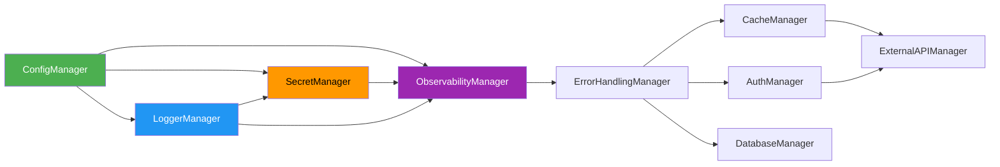

# Ports &amp; Adapters Architecture

Every manager in core-cenf follows the **Ports &amp; Adapters** pattern (also known as
Hexagonal Architecture). This page explains what the pattern is, why it matters, and how
it is implemented in this codebase.

## The Two Roles

### Port: the Contract

A **Port** is a Python `Protocol` (structural interface) that defines WHAT a manager
does — its method signatures, type hints, return values, and semantic rules. Ports live
in `ports.py` files inside each manager package. They carry `@ai-directive` docstring
annotations that tell both humans and AI agents HOW to use them correctly.

A Port has zero implementation. It is pure contract:

```python
from typing import Literal, Protocol, runtime_checkable

Env = Literal["local", "dev", "staging", "prod"]

@runtime_checkable
class ConfigManager(Protocol):
    """Configuration contract for the 12-factor app pattern."""

    def get_env(self) -> Env: ...
    def get_string(self, key: str, default_value: str | None = None) -> str: ...
    def get_number(self, key: str, default_value: float | None = None) -> float: ...
    def get_boolean(self, key: str, default_value: bool | None = None) -> bool: ...
    def get_json(self, key: str, default_value: Any = None) -> Any: ...
    def get_section(self, namespace: str) -> dict[str, Any]: ...
    async def reload(self) -> None: ...
    def get_json_schema(self) -> dict[str, Any]: ...
```

This is the **only thing your application code imports**. You never import an adapter
directly from your domain logic, handlers, or services.

### Adapter: the Implementation

An **Adapter** is a concrete class that implements the Protocol. core-cenf ships at least
two adapters per manager:

| Adapter type | Purpose | Example |
|---|---|---|
| **Production adapter** | Real implementation with external dependencies | `PydanticConfigAdapter` (reads YAML + env vars) |
| **In-memory test double** | Zero-dependency fake for unit tests and demos | `InMemoryConfigAdapter` (reads a dict) |

```python
# Production adapter — reads from YAML files + environment variables
class PydanticConfigAdapter:
    def get_string(self, key: str, default_value: str | None = None) -> str:
        return self._store.get(key, default_value)

# Test double — reads from a plain dict
class InMemoryConfigAdapter:
    def __init__(self, initial_data: dict[str, Any] | None = None):
        self._store = initial_data or {}

    def get_string(self, key: str, default_value: str | None = None) -> str:
        return self._store.get(key, default_value)
```

## Why This Pattern?

### 1. Swap Implementations Without Touching Business Logic

When you depend on `ConfigManager` (the Protocol), you can run your entire application
with real adapters in production and in-memory adapters in tests — without changing a
single import in your domain code.

```python
# Domain code — depends ONLY on Protocol
def process_order(config: ConfigManager, cache: CacheManager) -> None:
    env = config.get_env()
    ttl = config.get_number("cache.ttl", default_value=300)
    order = cache.get(f"order:{oid}")

# Test — inject InMemoryConfigAdapter
config = InMemoryConfigAdapter({"cache.ttl": 60})
cache = MemoryCacheAdapter(config=config, ...)
process_order(config, cache)

# Production — inject PydanticConfigAdapter (same function, different adapter)
config = PydanticConfigAdapter(config_path="/etc/myapp/config.yaml")
cache = RedisCacheAdapter(config=config, ...)
process_order(config, cache)
```

### 2. Dependency Graph Is Explicit

Every adapter declares its dependencies in `__init__`. The wiring order is enforced by
the dependency graph:



`ConfigManager` has zero dependencies — it is the root. `LoggerManager` depends only on
`ConfigManager`. `ExternalAPIManager` depends on five other managers. The graph is
acyclic and wired at bootstrap.

### 3. Testability Is Built In

Because every manager has an in-memory test double, you can:

- Test a single manager in complete isolation.
- Verify captured state (`logger.get_logs()`, `observability.get_metrics()`).
- Simulate failures (`InMemoryRateLimitAdapter(mode="always_deny")`).
- Never hit a real database, network, or filesystem in unit tests.

```python
# Test: verify error is captured and classified
error_handler = CapturingErrorAdapter(config, logger, observability)

@error_handler.handle_errors()
def flaky_operation():
    raise TransientError("Timeout", details={"service": "db"})

result = flaky_operation()
assert result is None
captured = error_handler.get_captured()
assert isinstance(captured[0], TransientError)
assert error_handler.classify(captured[0]) == ErrorType.TRANSIENT
```

### 4. AI Agents Understand the Contract

`@runtime_checkable` Protocols with docstrings enable AI coding agents to discover the
contract surface via `isinstance()` checks and docstring introspection. Combined with
`get_json_schema()` (which returns JSON Schema for LLM tool discovery), agents can
understand a manager's API without scanning implementation code.

## The AsyncLifecycle Protocol

Every adapter also implements a second Protocol: `AsyncLifecycle`. This is the lifecycle
contract that `BootstrapOrchestrator` uses to start, stop, and health-check all managers.

```python
@runtime_checkable
class AsyncLifecycle(Protocol):
    async def start(self) -> None: ...
    async def stop(self) -> None: ...
    async def health(self) -> HealthStatus: ...
```

Rules enforced by the contract:

- `start()` MUST be idempotent (can be called multiple times safely).
- `stop()` MUST be safe to call multiple times.
- `health()` MUST NEVER raise — return `status="degraded"` on internal failure.

## Crossing the Boundary

Your domain code lives inside the hexagon. Adapters live outside. The Port is the
boundary. Data that crosses it must be validated:

```python
# Boundary validation via Pydantic models
class CoreSettings(BaseModel):
    env: Literal["local", "dev", "staging", "prod"] = Field(default="dev")
    app_name: str = Field(min_length=1, max_length=128)
    version: str = Field(pattern=r"^\d+\.\d+\.\d+")
    log_level: Literal["DEBUG", "INFO", "WARNING", "ERROR"] = Field(default="INFO")
```

Every manager has a Pydantic `models.py` that validates data at the boundary. Invalid
data fails at startup, not deep in application code.

## Summary

| Concept | Role | File |
|---------|------|------|
| **Protocol** (Port) | Defines WHAT — the contract | `ports.py` |
| **Model** | Validates data at the boundary | `models.py` |
| **Adapter** (Production) | Implements HOW — real I/O | `adapters/production_adapter.py` |
| **Adapter** (Test double) | Implements HOW — zero deps | `adapters/in_memory_adapter.py` |
| **AsyncLifecycle** | Defines start/stop/health | `common/lifecycle.py` |

**The Golden Rule, restated**: your code depends on the Protocol. The adapter is injected
at startup. Swap adapters without touching business logic.
