# What is core-cenf?

**core-cenf** is a reusable infrastructure library for Python 3.12+ providing 16 horizontal
transversal managers following **Clean Architecture (Ports &amp; Adapters)**. Every CENF
program — backend APIs, AI agents, workflows, UIs — uses these managers for all
cross-cutting concerns. You never write config loading, logging, error handling, or
observability from scratch again.

## Who is it for?

### CENF Developers

If you build services on the CENF platform, core-cenf gives you production-ready
infrastructure out of the box. You wire up managers at bootstrap, inject them via
constructor DI, and focus on domain logic — not plumbing.

### AI Coding Agents

Every manager Protocol carries `@ai-directive` annotations that tell AI coding agents
HOW to use the manager correctly. The `AGENTS.md` file (90-second read) is the single
entry point for any AI agent working on a CENF codebase. Managers expose
`get_json_schema()` so agents can discover configuration keys without scanning source.

## Architecture at a Glance

```mermaid
graph TB
    subgraph "Your Application Code"
        APP[Domain Logic]
    end

    subgraph "Ports (Protocols)"
        P_CONFIG[ConfigManager]
        P_LOGGER[LoggerManager]
        P_SECRET[SecretManager]
        P_ERROR[ErrorHandlingManager]
        P_OBS[ObservabilityManager]
        P_AUTH[AuthManager]
        P_CACHE[CacheManager]
        P_DB[DatabaseManager]
        P_FILE[FileStorageManager]
        P_QUEUE[TaskQueueManager]
        P_HTTP[ExternalAPIManager]
        P_FLAG[FeatureFlagManager]
        P_DEP[DependencyManager]
        P_PROMPT[DynamicPromptingManager]
        P_ALERT[AlertManager]
        P_RATE[RateLimiterManager]
    end

    subgraph "Adapters (Implementations)"
        A_CONFIG[PydanticConfigAdapter<br/>InMemoryConfigAdapter]
        A_LOGGER[StructlogAdapter<br/>InMemoryLoggerAdapter]
        A_SECRET[EncryptedSecretAdapter<br/>InMemorySecretAdapter]
        A_ERROR[ClassificationAdapter<br/>CapturingErrorAdapter]
        A_OBS[OTelAdapter<br/>InMemoryObservabilityAdapter]
        A_AUTH[JwtAuthAdapter<br/>StaticAuthAdapter]
        A_CACHE[RedisCacheAdapter<br/>MemoryCacheAdapter]
        A_DB[SQLAlchemyAdapter<br/>MemoryDatabaseAdapter]
        A_FILE[S3StorageAdapter<br/>LocalStorageAdapter<br/>MemoryStorageAdapter]
        A_QUEUE[SAQTaskQueueAdapter<br/>MemoryTaskQueueAdapter]
        A_HTTP[ResilientHTTPAdapter<br/>MockHTTPAdapter]
        A_FLAG[FileFeatureFlagAdapter<br/>MemoryFeatureFlagAdapter]
        A_DEP[ImportlibDependencyAdapter<br/>InMemoryDependencyAdapter]
        A_PROMPT[ConditionalPromptAdapter]
        A_ALERT[DispatchAlertAdapter]
        A_RATE[TokenBucketAdapter<br/>InMemoryRateLimitAdapter]
    end

    APP --> P_CONFIG
    APP --> P_LOGGER
    APP --> P_CACHE

    P_CONFIG -. injected at startup .-> A_CONFIG
    P_LOGGER -. injected at startup .-> A_LOGGER
    P_SECRET -. injected at startup .-> A_SECRET
    P_ERROR -. injected at startup .-> A_ERROR
    P_OBS -. injected at startup .-> A_OBS
    P_AUTH -. injected at startup .-> A_AUTH
    P_CACHE -. injected at startup .-> A_CACHE
    P_DB -. injected at startup .-> A_DB
    P_FILE -. injected at startup .-> A_FILE
    P_QUEUE -. injected at startup .-> A_QUEUE
    P_HTTP -. injected at startup .-> A_HTTP
    P_FLAG -. injected at startup .-> A_FLAG
    P_DEP -. injected at startup .-> A_DEP
    P_PROMPT -. injected at startup .-> A_PROMPT
    P_ALERT -. injected at startup .-> A_ALERT
    P_RATE -. injected at startup .-> A_RATE
```



**The Golden Rule**: your code depends on the Protocol (abstract interface). The adapter
(concrete implementation) is injected at startup. Swap adapters without touching a single
line of business logic.

```python
# ✅ CORRECT: depend on Protocol
from core_infrastructure.config.ports import ConfigManager

def my_function(config: ConfigManager):
    db_host = config.get_string("db.host")

# ❌ WRONG: depend on adapter directly
from core_infrastructure.config.adapters.pydantic_config_adapter import PydanticConfigAdapter
```

## The 16 Managers

| # | Manager | What it does | Key method |
|---|---------|-------------|------------|
| M01 | **ConfigManager** | Read-only config from YAML+env | `get_string(key)` |
| M02 | **LoggerManager** | Structured logging (dev/test/prod) | `logger.info(msg, **ctx)` |
| M03 | **SecretManager** | Encrypted credential storage | `get_secret(key)` |
| M04 | **ErrorHandlingManager** | Classify &amp; report errors | `@handle_errors` decorator |
| M05 | **ObservabilityManager** | OTel RED metrics &amp; tracing | `increment_counter(name)` |
| M06 | **AuthManager** | JWT validation (HS256) | `validate_token(token)` |
| M07 | **CacheManager** | KV cache with stampede protection | `get_or_set(key, factory, ttl)` |
| M08 | **DatabaseManager** | Transactions + generic repos | `transaction()` context mgr |
| M09 | **FileStorageManager** | Multi-cloud blob storage | `upload(bucket, key, data)` |
| M10 | **TaskQueueManager** | Async jobs with DLQ | `enqueue(queue, payload)` |
| M11 | **ExternalAPIManager** | Resilient HTTP with circuit breaker | `get(url)` / `post(url, body)` |
| M12 | **FeatureFlagManager** | Runtime toggles (YAML→Unleash) | `is_enabled(flag, context)` |
| M13 | **DependencyManager** | Lazy safe import resolution | `resolve_class(module, class)` |
| M14 | **DynamicPromptingManager** | Conditional prompt assembly | `assemble(base, blocks, ctx)` |
| M15 | **AlertManager** | Slack/Discord/Email alerts | `send_alert(level, title, msg)` |
| M16 | **RateLimiterManager** | Token bucket rate limiting | `is_allowed(bucket_key)` |

## Cross-Cutting Patterns

Every manager shares these design invariants:

- **Constructor DI**: Dependencies are passed to `__init__`, never looked up from a global.
- **Context propagation**: Correlation IDs and tenant IDs propagate implicitly via
  `contextvars` — never passed as explicit function arguments. See
  [Context Propagation](./core-concepts/context-propagation).
- **Error taxonomy**: Five error types (`TransientError`, `PermanentError`,
  `ValidationError`, `AuthError`, `RateLimitError`) determine retry vs. fail-fast
  behavior across ALL managers.
- **AsyncLifecycle**: Every adapter implements `start()`, `stop()`, `health()`.
  `BootstrapOrchestrator` runs them in dependency order with `asyncio.TaskGroup`.
- **In-memory test doubles**: Every manager ships with an in-memory adapter. Your tests
  never hit a real database, network, or filesystem.

## Quick Navigation

- **[Installation](./getting-started/installation)** — pip install, prerequisites, verify
- **[Quick Start](./getting-started/quick-start)** — 5-minute bootstrap with all 16 managers
- **[Ports &amp; Adapters](./core-concepts/ports-and-adapters)** — the architectural pattern explained
- **[Context Propagation](./core-concepts/context-propagation)** — how contextvars work
- **[Agent Experience](./core-concepts/agent-experience)** — how AI coding agents discover and use managers
- **[API Reference](./reference/api/overview)** — complete Protocol and model surface
- **[Managers](../managers/config-manager)** — deep-dive per manager
